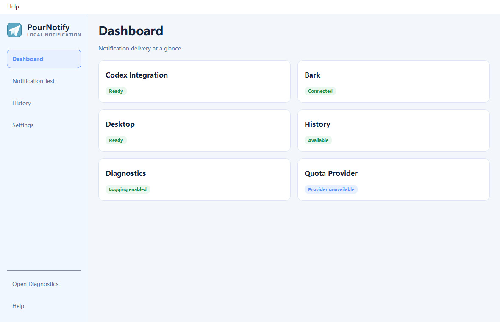

<div align="center">


# PourNotify

### Local-first desktop, sound, Bark, and History notifications for Codex.

[](https://github.com/pour-soi/PourNotify/releases/tag/v1.0.4)
[](https://github.com/pour-soi/PourNotify/actions/workflows/build.yml)
[](#download)
[](#project-status)
[](LICENSE)

[Latest release](https://github.com/pour-soi/PourNotify/releases/tag/v1.0.4) ·
[Windows download](https://github.com/pour-soi/PourNotify/releases/download/v1.0.4/PourNotify-v1.0.4-Windows.exe) ·
[Source code](https://github.com/pour-soi/PourNotify/tree/v1.0.4) ·
[Quick start](#quick-start) ·
[Codex integration](#codex-integration) ·
[History & diagnostics](#history-and-diagnostics)

</div>



## What's new in v1.0.4

- Introduces the new Pour UI paper-airplane application icon.
- Adds optional Windows login startup that runs silently without opening or flashing the main window.
- Prevents duplicate startup launches from creating a second resident, while a normal manual launch
  still opens the existing application window.
- Preserves compatibility with existing Codex, IPC, Bark, desktop, sound, History, and Diagnostics
  behavior.

## Overview

Codex invokes a notification hook when a task completes. PourNotify accepts that event from a
short-lived local process or an already-running instance over Qt local IPC, classifies it, and
routes it through the channels enabled for that category. Desktop banners, sound, Bark, and local
History all use the same dispatcher, so a test notification follows the same delivery path as a
real Codex completion.

PourNotify is local-first: configuration, History, and diagnostics stay on the computer. There is
no PourNotify account or hosted backend.

## Features

| Area | What is available |
| --- | --- |
| Delivery | Native desktop notifications, configurable sounds, Bark delivery, and local History |
| Controls | Independent category enablement, delivery channels, sound selection, volume, and priority |
| Focus | Quiet hours, critical-event exceptions, cooldowns, rate limits, and duplicate suppression or merging |
| History | Search, copy, full notification details, duplicate counts, and JSON or CSV export |
| Validation | Built-in notification test cases that use the production dispatcher |
| Reliability | Single-instance Qt IPC with a temporary-process fallback when the resident app is not running |
| Diagnostics | Rotating JSONL delivery diagnostics with Bark credentials redacted |
| Appearance | System, light, and dark themes with the same navigation and information layout |

## Download

The latest stable release is **v1.0.4**.

- **Windows:** download [`PourNotify-v1.0.4-Windows.exe`](https://github.com/pour-soi/PourNotify/releases/download/v1.0.4/PourNotify-v1.0.4-Windows.exe).
- **All releases:** visit [GitHub Releases](https://github.com/pour-soi/PourNotify/releases).
- The automatically generated source archives are source code, not the normal Windows executable.
- Windows and macOS builds pass in CI. Physical macOS runtime validation is still pending, and the
  v1.0.4 release currently publishes only the Windows executable.

## Quick start

1. Download and launch the latest Windows release.
2. Open **Settings** and choose the desktop, sound, Bark, and History behavior you want.
3. Optionally enable **Start PourNotify automatically when I sign in**. Login startup runs silently
   in the background and keeps PourNotify available from the system tray.
4. If using Bark, enter your HTTPS Bark server and device key locally in PourNotify.
5. Connect the global Codex notification hook using the example below.
6. Use **Notification Test**, then complete a real Codex task to verify the full route.

When PourNotify is already running, launching it normally opens the existing window. Login startup
does not open the window or create a second resident.

The packaged Windows application does not require a separate Python installation.

## Codex integration

PourNotify accepts one CLI argument: `--notify <Codex JSON payload>`. A stable installation path is
important because Codex invokes that executable after every supported event.

If Codex already uses the `codex-computer-use` `turn-ended` wrapper, keep the wrapper and set
PourNotify as its previous notification command. In the global Codex `config.toml`, preserve the
existing wrapper path and use this structure:

```toml
notify = [
  "<CODEX_COMPUTER_USE_PATH>",
  "turn-ended",
  "--previous-notify",
  "[\"<POURNOTIFY_INSTALL_PATH>\\\\PourNotify.exe\",\"--notify\"]",
]
```

Replace both placeholders with stable local paths. On Windows, a suitable PourNotify location is
under `%LOCALAPPDATA%\Programs\PourNotify`; do not point the hook at a project's temporary `dist`
directory.

The wrapper preserves Codex's existing turn-completion handling and forwards the payload to
PourNotify. Keep Bark configured inside PourNotify rather than adding a second independent Bark
notification script, which would duplicate deliveries.

When PourNotify is already resident, the temporary invocation sends the JSON payload to it through
local Qt IPC and exits. If no resident process accepts the connection, the invocation starts a
hidden temporary instance, processes the same payload locally, and exits after delivery.

> PourNotify currently parses Codex `agent-turn-complete` hook events. Other payload types are
> recorded as unsupported diagnostics rather than presented as supported external notifications.

## Notification controls

Each notification category keeps its own settings for:

- enabled state;
- desktop, Bark, sound, and History delivery;
- selected sound and volume;
- priority.

Global settings add quiet hours, Bark silence during quiet hours, critical-event exceptions,
cooldowns, per-minute limits, and duplicate suppression or merging. The current application ships
with 13 configurable categories; the names are intentionally left to the UI because they are
application configuration rather than a promised public API.

## History and diagnostics

History is stored locally and can be searched, copied, cleared, or exported as JSON or CSV. It
preserves the complete notification message while the desktop and Bark presentation may use a
shorter delivery preview.

**Help > Open Notification Diagnostics** opens the local diagnostics directory. Each received hook
event produces a JSONL record containing its source, dispatch status, channel attempts and results,
HTTP status, duration, and any exception. Logs rotate automatically and never include the configured
Bark device key.

## Privacy

- PourNotify has no hosted backend, user account, telemetry, or browser cookies.
- Configuration, notification History, and diagnostic logs remain in the local application-data
  directory unless you explicitly export History.
- PourNotify does not collect or store full Codex conversations. It does store the notification
  content supplied by the Codex hook in local History, and diagnostics retain the received event
  payload for troubleshooting.
- Bark delivery sends the notification title and body to the HTTPS Bark server you configure.
- The Bark device key is stored in local configuration. Never commit that file or paste the key into
  issues, logs, screenshots, or examples.
- Bark responses are redacted before diagnostics are written, and automated coverage verifies that
  the device key is absent from diagnostic records.

## Development

PourNotify requires Python 3.11 or newer for source development.

```powershell
python -m venv .venv
.\.venv\Scripts\Activate.ps1
python -m pip install -e ".[dev]"
```

Run the application from source:

```powershell
python -m pournotify
```

Run the repository checks:

```powershell
python -m ruff check .
python -m pytest
```

Create a clean PyInstaller build (the script runs the full test suite first):

```powershell
powershell -ExecutionPolicy Bypass -File .\scripts\build.ps1
```

Build output is written to `dist/`. The same test, Ruff, and PyInstaller commands run on
`windows-latest` and `macos-latest` in GitHub Actions.

## Project status

- Latest stable release: **v1.0.4**
- Windows runtime validation: complete
- Silent Windows login startup and single-resident behavior: validated
- Windows toast, Notification Center retention, sound, Bark, History, Diagnostics, and IPC:
  validated
- Windows and macOS CI jobs: passing
- Physical macOS runtime validation: pending

## Contributing

1. Fork the repository.
2. Create a focused branch for the change.
3. Keep the diff scoped and add or update meaningful tests when behavior changes.
4. Run Ruff and the full pytest suite.
5. Open a pull request describing the change and its validation.

## License

PourNotify is available under the [MIT License](LICENSE).
